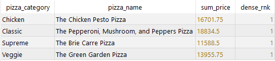
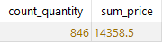
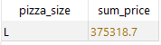
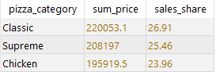
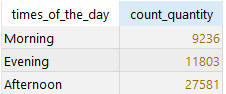
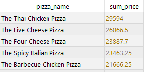

# 🍕 Pizza Sales Dashboard & SQL Analytics Project

This project covers the **analysis of pizza sales data using SQL and Power BI**.  
**SQL** queries were used to answer specific business questions and extract insights,  
while **Power BI** was utilized to present the overall trends and key performance indicators (KPIs) in a **visual and interactive** way.

---

## Tools Used

*I. SQL (PostgreSQL): data extraction and analysis*  
*II. Power BI: visual reporting and presentation of indicators*

---

## I. SQL Phase

### **Question 1:** The most profitable pizza in each category  
📄 **Script:** [Script 1](Scripts/Script_1.sql)  
📊 **Result:**  

---

### **Question 2:** Number of orders and total revenue during the first 7 days of 2015  
📄 **Script:** [Script 2](Scripts/Script_2.sql)  
📊 **Result:**  

---

### **Question 3:** Which pizza size has the highest sales?  
📄 **Script:** [Script 3](Scripts/Script_3.sql)  
📊 **Result:**  

---

### **Question 4:** Top 3 pizza categories by revenue and their total income share (%)  
📄 **Script:** [Script 4](Scripts/Script_4.sql)  
📊 **Result:**  

---

### **Question 5:** Number of orders by time of day (morning, afternoon, evening, night)  
📄 **Script:** [Script 5](Scripts/Script_5.sql)  
📊 **Result:**  

---

### **Question 6:** Pizzas with total revenue higher than the average  
📄 **Script:** [Script 6](Scripts/Script_6.sql)  
📊 **Result:**  

---

## II. Power BI Phase

📊 **Dashboard:**  

---

### **1. Key Performance Indicators (KPIs)**

**1. Pizza Category** – 4 main categories: *Classic, Supreme, Veggie, Chicken*  
**2. Total Revenue** – **≈ 46 million**  
**3. Total Quantity Sold** – **≈ 50,000 pizzas**

---

### **2. Main Analyses**

- 🍕 Top-selling pizzas and their revenue  
- 📊 Sales share by category  
- 📅 Quarterly revenue trends  
- 📆 Monthly income variations  
- 📏 Sales share by pizza size

---

### **3. Results**

**1. Classic** category leads both in revenue and sales volume.  
**2. Large (L) pizzas** are the most popular among customers.  
**3. A noticeable sales drop in September** is observed — likely due to a non-promotional period.  
**4. Sales remain consistent across quarters** (around 11 million per quarter).

---

## 🧾 Conclusion

This project demonstrates the ability to **analyze data using SQL** and **create compelling visual stories with Power BI**.  
It showcases how analytical and visual layers work together to support **data-driven decision making**.

---

## Author  

**Sevinc Qiyasova**  
[My GitHub Profile](https://github.com/sevinc-giyasova)